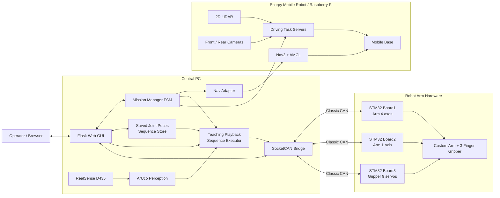

<div align="center">

## 3지 그리퍼와 5축 로봇팔 기반 자율주행 시설 관리 로봇 'Scorpy' 개발

<p align="center">
  
  
  
  
  
  
  
</p>

Scorpy는 모바일 로봇, 자체제작 로봇팔과 그리퍼를 통합하여 물체를 집고,
엘리베이터를 이용해 층간 이동한 뒤 지정 위치에 배송하고 출발지로 복귀하는 로봇 시스템입니다.

</div>

---

## 1. 프로젝트 개요

Scorpy는 4층 402호에서 물체를 픽업한 뒤 5층 배송 장소까지 운반하고 다시 402호로 복귀하는 고정 데모 시나리오를 수행합니다. 중앙 서버의 Mission FSM이 자율주행, 엘리베이터 탑승·하차, ArUco 인식, Teaching Playback 기반 로봇팔·그리퍼 시퀀스, 버튼 조작, 맵 전환을 하나의 ROS 2 Action 기반 미션으로 연결합니다.

### 최종 데모 시나리오

```text
4F 402
  → 로봇팔 Homing 및 준비 자세
  → ArUco ID 54 물체 확인 후 사전 티칭된 파지 시퀀스 실행
  → 물체를 로봇 트레이에 적재
  → Nav2로 4층 엘리베이터 이동
  → ArUco 기반 정렬 및 호출 버튼 조작
  → 엘리베이터 탑승 후 5층 버튼 조작
  → 5층 도착 확인 및 맵 전환
  → object_place로 이동해 물체 배송
  → 엘리베이터를 이용해 4층 복귀
  → 4F 402로 귀환
```

현재 최종 Mission Manager는 검증된 시나리오를 위해 다음 입력만 허용합니다.

| 항목 | 값 |
|---|---|
| 픽업 위치 | `402` |
| 배송 위치 | `object_place` |
| 목적 층 | `5` |
| 대상 물체 | `object_1` |
| 배송 로봇팔 태스크 | `deliver_object_1_from_tray` |

---

## 2. 주요 기능

### 자율주행 및 층간 이동

- Nav2와 AMCL을 이용한 4층·5층 자율주행
- 층별 Occupancy Grid 맵 로딩과 `/initialpose` 재설정
- ArUco ID 20 기반 엘리베이터 앞 정렬
- LiDAR 기반 엘리베이터 문 열림 감지
- 전·후방 카메라를 이용한 탑승, 하차 및 층 마커 확인
- Odometry 기반 직진·회전 Action Server

### 로봇팔 및 그리퍼

- 커스텀 5축 로봇팔과 9축 3지 그리퍼 제어
- Flask GUI에서 각 관절의 목표 각도, 이동 시간, 자세 유지 시간을 직접 설정
- 조정이 완료된 자세를 저장하고 작업 순서에 맞게 연속 재생하는 **Teaching Playback** 방식 적용
- 물체 파지, 트레이 적재, 배송, 엘리베이터 버튼 누르기를 작업별 관절 시퀀스로 구성
- 로봇팔은 Board1·Board2, 그리퍼는 Board3에 목표값을 전송하여 직접 구동
- ArUco는 물체와 버튼의 식별·작업 조건 확인에 사용하며, 최종 관절 동작은 저장된 티칭 각도를 사용
- `plan_only`와 `hardware` 실행 모드를 통해 하드웨어 미동작 점검과 실제 구동을 분리

#### MoveIt 2에서 Teaching Playback으로 변경한 이유

초기에는 MoveIt 2로 로봇 모델 기반 경로와 자세를 생성했지만, 실제 하드웨어에서는 조립 오차, 관절 영점과 모델 간 차이, 링크 유격 등의 영향으로 엔드 이펙터 위치 정확도가 충분하지 않았습니다. 특히 엘리베이터 버튼 조작과 물체 파지처럼 반복 정밀도가 중요한 작업에서 오차가 크게 나타나, 최종 시스템은 작업자가 GUI에서 실제 관절 각도를 직접 보정하고 검증된 자세를 순서대로 재생하는 Teaching Playback 방식으로 변경했습니다.

현재 저장소의 MoveIt 2 설정 패키지는 초기 실험, 로봇 모델 확인 및 시각화 호환을 위해 남아 있지만, **최종 로봇팔 동작 생성에는 사용하지 않습니다.**

### CAN 통신

- Linux SocketCAN 기반 중앙 PC–STM32 제어보드 통신
- Board1: 로봇팔 4축
- Board2: 로봇팔 1축
- Board3: 그리퍼 서보 9축
- Enable, E-Stop, Homing, 위치 명령, 상태, 위치 피드백, ACK 처리
- 실제 CAN 인터페이스 `can0`와 개발용 가상 인터페이스 `vcan0` 지원

### 중앙 서버 및 Web GUI

- Flask 기반 브라우저 대시보드
- 전체 미션 시작·취소 및 FSM 진행 상태 표시
- 실시간 지도, 로봇 위치, Global/Local Path 표시
- 지도 위 드래그를 통한 초기 위치 설정
- 로봇팔·그리퍼 수동 제어 및 현재 Joint State 확인
- 현재 자세 저장, 수정, 삭제 및 저장 자세 순차 실행
- 제어보드 상태, 오류, 미션 이벤트 및 재연결 로그 동기화

---

## 3. 시스템 아키텍처



### 최종 로봇팔 제어 흐름

```text
GUI에서 관절별 목표 각도 조정
  → 이동 시간 및 자세 유지 시간 설정
  → 검증된 자세 저장
  → 작업별 자세 순서 구성
  → Teaching Playback 실행
  → ROS 2 Controller Action Goal 전송
  → SocketCAN Bridge가 STM32 명령으로 변환
  → Board1·2 로봇팔 / Board3 그리퍼 구동
  → 상태·위치 피드백과 완료 여부 확인
```

### 통신 구조

| 구간 | 방식 | 역할 |
|---|---|---|
| 중앙 PC ↔ Raspberry Pi | ROS 2 DDS | 미션 Action, Nav2 목표, 상태·센서·맵 데이터 공유 |
| 중앙 PC ↔ STM32 Board1/2/3 | SocketCAN / Classic CAN | 로봇팔·그리퍼 명령, 상태, ACK, 위치 피드백 |
| GUI ↔ 중앙 서버 | HTTP / Flask | 미션 실행, 수동 제어, 상태 및 로그 확인 |
| 카메라 ↔ 인식 노드 | ROS 2 Image / CameraInfo | ArUco ID 검출 및 상대 Pose 확인 |

---

## 4. 하드웨어 구성

| 분류 | 구성 |
|---|---|
| 모바일 플랫폼 | Scorpy 주행 로봇, Raspberry Pi 기반 ROS 2 제어 |
| 주행 센서 | 2D LiDAR, 전방·후방 USB 카메라, Odometry |
| 매니퓰레이터 | 커스텀 5축 로봇팔 |
| 엔드 이펙터 | 9축 3지 그리퍼 |
| 비전 센서 | Intel RealSense D435 손목 카메라 |
| 제어보드 | STM32 Board1, Board2, Board3 |
| 통신 장치 | USB-to-CAN 또는 SocketCAN 호환 CAN 인터페이스 |
| 중앙 제어 | ROS 2 Jazzy가 설치된 PC |

---

## 5. 소프트웨어 스택

| 영역 | 기술 |
|---|---|
| Middleware | ROS 2 Jazzy, DDS, ROS 2 Action/Topic/Service |
| Navigation | Nav2, AMCL, Map Server, TF2 |
| Manipulation | Teaching Playback, Saved Joint Pose Sequence, ROS 2 Controller Action, URDF/Xacro |
| Perception | OpenCV ArUco, cv_bridge, RealSense ROS |
| Embedded Interface | SocketCAN, Classic CAN, STM32 |
| Backend | Python, rclpy, Flask |
| Frontend | HTML, CSS, JavaScript, Canvas |
| Configuration | YAML |
| Test | pytest, ament lint, ROS 2 integration tests |

---

## 6. 주요 ROS 2 인터페이스

### Mission 및 주행 Action

| Action 이름 | 타입 | 역할 |
|---|---|---|
| `/mission/execute` | `ExecuteMission` | 전체 배송 미션 실행 |
| `/mission/ready_and_approach` | `RunTask` | 로봇팔 준비와 지연 직진 동시 조정 |
| `/nav/go_to` | `RunTask` | 위치 이름을 Nav2 목표 Pose로 변환 |
| `/dock/align` | `RunTask` | ArUco 기반 엘리베이터 정렬 |
| `/elevator/wait_door_open` | `RunTask` | LiDAR 기반 문 열림 대기 |
| `/elevator/board` | `RunTask` | 엘리베이터 탑승 |
| `/elevator/exit` | `RunTask` | 도착층 확인 후 하차 |
| `/floor/check` | `RunTask` | 층 마커 기반 도착 확인 |
| `/map/switch` | `RunTask` | 층별 맵 로드 및 초기 Pose 설정 |
| `/base/drive_straight` | `RunTask` | Odometry 기반 직진 |
| `/base/rotate` | `RunTask` | Odometry 기반 회전 |

### 로봇팔 Action

| Action 이름 | 역할 |
|---|---|
| `/arm/execute` | 작업별 Teaching Playback 태스크 실행 |
| `/arm/pick` | 사전 티칭된 물체 파지 시퀀스 실행 |
| `/arm/place` | 사전 티칭된 물체 배치 시퀀스 실행 |
| `/arm/press_button` | 사전 티칭된 버튼 조작 시퀀스 실행 |
| `/arm/homing` | 로봇팔 Homing |
| `/arm_controller/execute_joint_goal` | Teaching Playback의 Board1/2 관절 목표 전송 |
| `/gripper_controller/follow_joint_trajectory` | Teaching Playback의 Board3 그리퍼 목표 전송 |

### 상태 및 GUI Topic

| Topic | 역할 |
|---|---|
| `/mission/status` | 현재 FSM 상태, 진행률, 오류 |
| `/mission/event_log` | 미션 이벤트 로그 |
| `/robot/heartbeat` | 중앙 서버 Heartbeat |
| `/arm_board/status_log` | CAN 제어보드 상태 및 Fault |
| `/joint_states` | 로봇팔·그리퍼 현재 각도 |
| `/map` | 현재 층 Occupancy Grid |
| `/amcl_pose` | 로봇 추정 위치 |
| `/odom` | 주행 Odometry |
| `/plan`, `/local_plan` | Nav2 Global/Local Path |
| `/initialpose` | GUI에서 설정한 초기 위치 |
| `/tag/floor_id` | 감지된 층 번호 |

---

## 7. ArUco Marker 구성

| Marker ID | 용도 |
|---:|---|
| `4` | 4층 랜딩 마커 |
| `5` | 5층 랜딩 마커 |
| `10` | 엘리베이터 내부 / 탑승 기준 마커 |
| `20` | 엘리베이터 앞 주행 정렬 마커 |
| `50` | 4층 엘리베이터 호출 버튼 |
| `51` | 엘리베이터 내부 4층 버튼 |
| `52` | 엘리베이터 내부 5층 버튼 |
| `53` | 5층 엘리베이터 호출 버튼 |
| `54` | 최종 데모 물체 `object_1` |
| `55` | 추가 물체 `object_2` 설정용 |

최종 미션에서 실제로 허용되는 물체는 현재 `object_1`입니다. ArUco Marker는 작업 대상을 구분하고 시퀀스 실행 조건을 확인하는 데 사용하며, 검출 Pose를 MoveIt 2 목표 자세로 변환해 로봇팔 경로를 자동 생성하지 않습니다.

---

## 8. CAN Protocol 요약

| 방향 | CAN ID | 의미 |
|---|---:|---|
| PC → 전체 보드 | `0x001` | Emergency Stop |
| PC → 전체 보드 | `0x010` | Enable |
| PC → 보드 | `0x020` | Homing |
| PC → Board3 | `0x023` | Gripper Home |
| PC → 전체 보드 | `0x030` | Error Clear |
| PC → Board1 | `0x101` | Arm Position Command |
| PC → Board2 | `0x102` | Arm Position Command |
| PC → Board3 | `0x103` | Gripper Servo Command |
| Board1/2/3 → PC | `0x201`–`0x203` | Board Status |
| Board1/2/3 → PC | `0x301`–`0x303` | Position Feedback |
| Board1/2 → PC | `0x401`, `0x402` | V3 ACK |

Board1/2의 완료 판단은 보드 상태, 오류, 이동 모터, Homing Mask, 최신 상태 여부를 함께 확인합니다. Board3는 9개 Servo 명령을 staging한 뒤 상태와 피드백을 조합해 그리퍼 상태를 관리합니다.

---

<div align="center">

**Scorpy — Autonomous Inter-Floor Delivery Robot**

</div>
