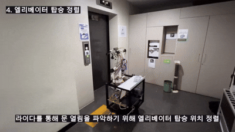
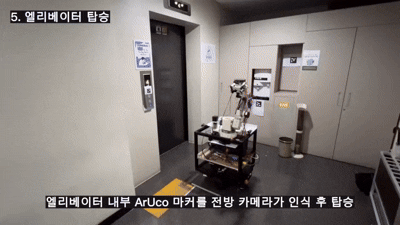
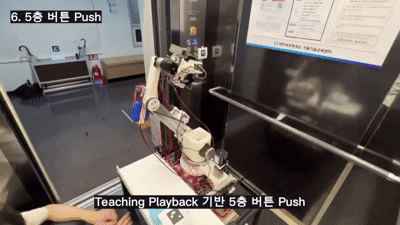
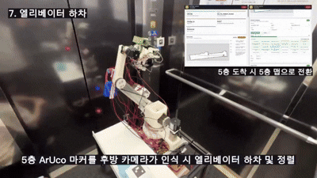

# Scorpy 시연

Scorpy가 물건을 집은 뒤 엘리베이터를 이용해 4층에서 5층으로 이동하고, 지정된 위치에 물건을 놓은 후 다시 4층 초기 위치로 복귀하는 전체 시연 과정입니다.

---

## 1. 물건 Pick

Scorpy가 출발 위치에 있는 물건을 집습니다.

---

## 2. 4층 엘리베이터 버튼 앞 정렬

4층 엘리베이터 호출 버튼을 누르기 위해 버튼 앞에 정렬합니다.

---

## 3. 엘리베이터 상승 버튼 Push

로봇팔을 이용해 엘리베이터 상승 호출 버튼을 누릅니다.

---

## 4. 엘리베이터 탑승 정렬

엘리베이터에 탑승하기 전 출입구 방향에 맞게 위치와 방향을 조정합니다.

---

## 5. 엘리베이터 탑승

엘리베이터 내부로 이동합니다.

---

## 6. 5층 버튼 Push

로봇팔을 이용해 엘리베이터 내부의 5층 버튼을 누릅니다.

---

## 7. 엘리베이터 하차

5층에 도착한 후 엘리베이터에서 하차합니다.

---

## 8. 물건 Place 위치로 이동

물건을 전달할 지정 위치로 이동합니다.

---

## 9. 물건 Pick & Place

운반한 물건을 지정된 위치에 내려놓습니다.

---

## 10. 5층 엘리베이터 버튼 앞 정렬

4층으로 복귀하기 위해 5층 엘리베이터 호출 버튼 앞에 정렬합니다.

---

## 11. 엘리베이터 하강 버튼 Push

로봇팔을 이용해 엘리베이터 하강 호출 버튼을 누릅니다.

---

## 12. 엘리베이터 탑승 정렬

엘리베이터에 다시 탑승하기 위해 출입구 방향에 맞게 정렬합니다.

---

## 13. 엘리베이터 탑승

엘리베이터 내부로 이동합니다.

---

## 14. 4층 버튼 Push

로봇팔을 이용해 엘리베이터 내부의 4층 버튼을 누릅니다.

---

## 15. 초기 위치 복귀

4층에 도착한 후 엘리베이터에서 하차하여 초기 위치로 복귀합니다.

